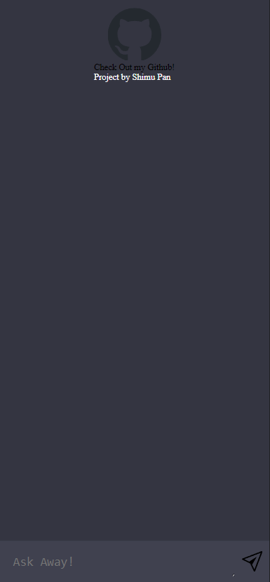

# CloneGPT
<a name="readme-top"></a>

[![LinkedIn][linkedin-shield]][linkedin-url]


<!-- PROJECT LOGO -->
<br />
<div align="center">
  <a href="https://github.com/shimupan">
    
  </a>

  <h3 align="center">Chat-GPT Clone</h3>

  <p align="center">
    Chat-GPT clone built with vanilla js and OpenAI's API
    <br />
  </p>
</div>


<!-- TABLE OF CONTENTS -->
<details>
  <summary>Table of Contents</summary>
  <ol>
    <li>
      <a href="#about-the-project">About The Project</a>
    </li>
    <li>
      <a href="#getting-started">Getting Started</a>
      <ul>
        <li><a href="#prerequisites">Prerequisites</a></li>
        <li><a href="#Setup">Setup</a></li>
      </ul>
    </li>
    <li><a href="#usage">Usage</a></li>
    <li><a href="#contributing">Contributing</a></li>
    <li><a href="#contact">Contact</a></li>
  </ol>
</details>


<!-- ABOUT THE PROJECT -->
## About The Project


Simple Chat-GPT clone application that is bulit with Html, Javascript, and Css.
<br/>
Integrated OpenAI's API to allow for communcation between the bot and end user.

<p align="right">(<a href="#readme-top">back to top</a>)</p>


<!-- GETTING STARTED -->
## Getting Started

To get a local copy up and running follow these simple example steps.

### Prerequisites

* Clone the repository

  ```sh
  git clone https://github.com/shimupan/CloneGPT.git
  ```  
* Run `npm install` within both client and client_api

  ```
  cd client && npm install
  ```
  ```
  cd client_api && npm install
  ```

### Setup

1. Get an API Key at [OpenAPI's website](https://platform.openai.com/)
2. Make an .env file within the client_api file and set `OPENAI_API_KEY` to your API key

   ```sh
   OPENAI_API_KEY="YOUR_API_KEY"
   ```
3. `cd` into `client` and start the server

   ```sh
   npm run dev
   ```
4. Open up a new terminal session and `cd` into `client_api` and start the server

   ```sh
   npm run server
   ```

   You should now be able to type and recieve a response!


<p align="right">(<a href="#readme-top">back to top</a>)</p>


<!-- USAGE EXAMPLES -->
## Usage

<p>Mobile Friendly</p>
<br/>
<p>Disclaimer: OpenAI's API is not completely free and price varies by model</p>

* To change the bot's model or parameters simply go into `api.js` within `client_api` and edit the parameters
* Visit OpenAI's API website to find examples of parameters for different bots

<p align="right">(<a href="#readme-top">back to top</a>)</p>


<!-- CONTRIBUTING -->
## Contributing

Contributions are welcomed and contributions you make are **greatly appreciated**.

<p align="right">(<a href="#readme-top">back to top</a>)</p>

<!-- CONTACT -->
## Contact

Shimu Pan - shimu.pan0@gmail.com

Project Link: [https://github.com/shimupan/CloneGPT](https://github.com/shimupan/CloneGPT)

<p align="right">(<a href="#readme-top">back to top</a>)</p>


[linkedin-shield]: https://img.shields.io/badge/-LinkedIn-black.svg?style=for-the-badge&logo=linkedin&colorB=555
[linkedin-url]: https://www.linkedin.com/in/shimupan/
